# Port Support Engineer Assignment - Solution Document

**Candidate:** Matthew Akinola

## Exercise #1: JQ Patterns for API Response Transformation

### Solution Overview
Successfully created JQ patterns to extract specific information from Kubernetes deployment objects and Jira API responses. All patterns were tested and validated using JQPlay.

### 1.1 Kubernetes Deployment Object Extract

**Task:** Extract information from K8s deployment object snippet

#### JQ Patterns Developed:

**a) Current replica count:**
- Pattern: `.spec.replicas`
- Result: Returns the number of replicas: `1`

**b) Deployment strategy:**
- Pattern: `.spec.strategy.type`
- Result: Returns strategy type: `"RollingUpdate"`

**c) Service-Environment label concatenation:**
- Pattern: `(.metadata.labels.service + "-" + .metadata.labels.environment)`
- Result: Returns concatenated string: `"authorization-production-gcp-1"`

#### Validation:
- All patterns tested successfully in JQPlay
- Results confirmed against provided deployment JSON

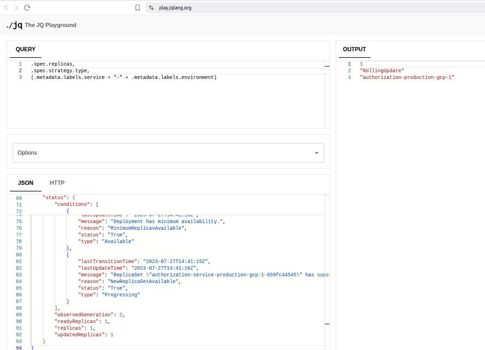

### 1.2 Jira API Subtask Extraction

**Task:** Extract all subtask issue IDs from Jira API response

#### JQ Pattern Developed:
- Pattern: `[.fields.subtasks[].key]`
- Result: Returns array of subtask IDs

#### Validation:
- Pattern tested in JQPlay with provided Jira JSON
- Successfully extracted 13 subtask IDs from the sample data

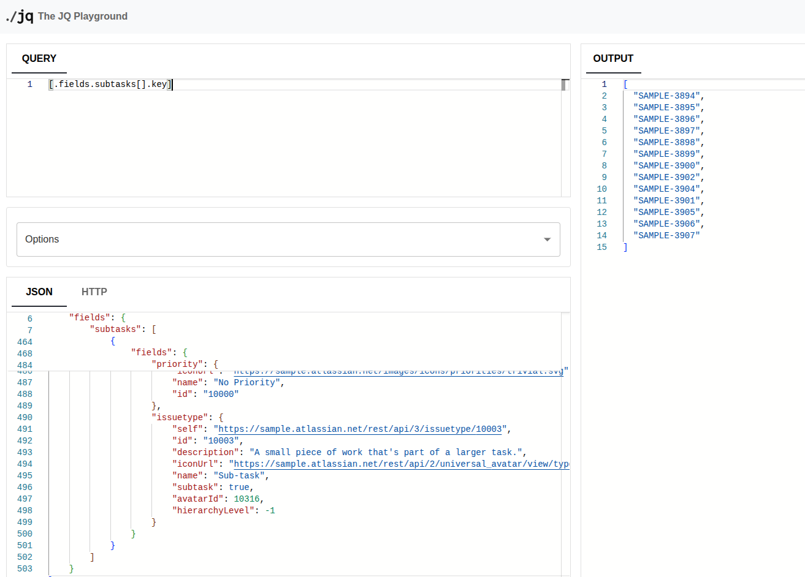

## Exercise #2: Port-Jira-GitHub Integration Setup

### Solution Overview
Successfully implemented end-to-end integration between Port, Jira, and GitHub with proper data model relationships and component mapping.

### 2.1 Initial Setup Completed
- Logged into Port using provided credentials
- Installed Port's GitHub App with proper permissions
- GitHub repositories automatically imported into Port
- Repository blueprint created automatically

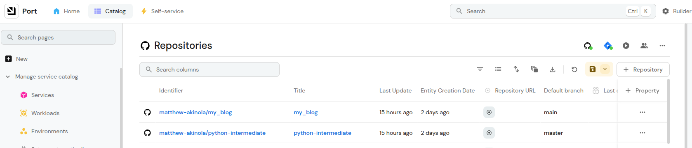
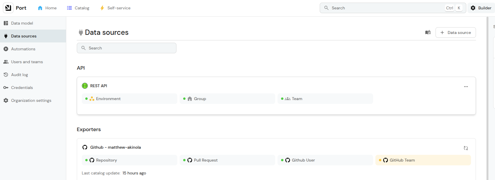

### 2.2 Jira Account and Project Setup

- Created free Jira account (akinolatolulope24.atlassian.net)
- Created new project with specifications:
  - Category: Software Development
  - Template: Scrum
  - Type: Company Managed Project (for components access)
  - Project Key: PORT

- Created Jira components matching GitHub repositories:
  - Component 1: "ec2-finOps" (matches GitHub repo)
  - Component 2: "rentrite-infra-gitOps" (matches GitHub repo)

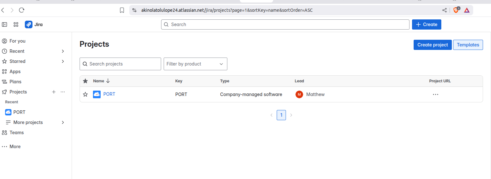
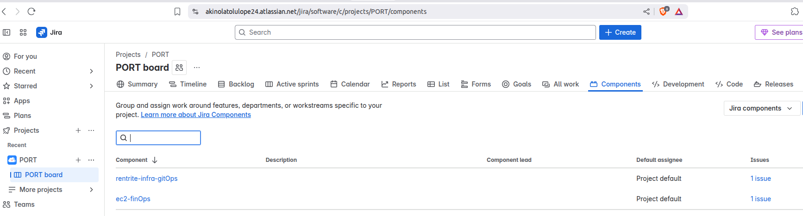

### 2.3 Port Ocean Jira Integration
- Installed Jira Ocean integration using "Scheduled" method
- Configured integration with GitHub workflow deployment
- Integration configuration:
  - Type: Scheduled (every hour) and workflow dispatch (for manual triggering)
  - Deployment: GitHub Actions workflow
  - Authentication: Jira API token and user email

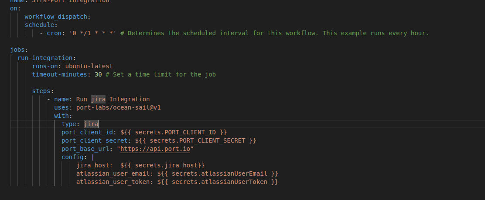
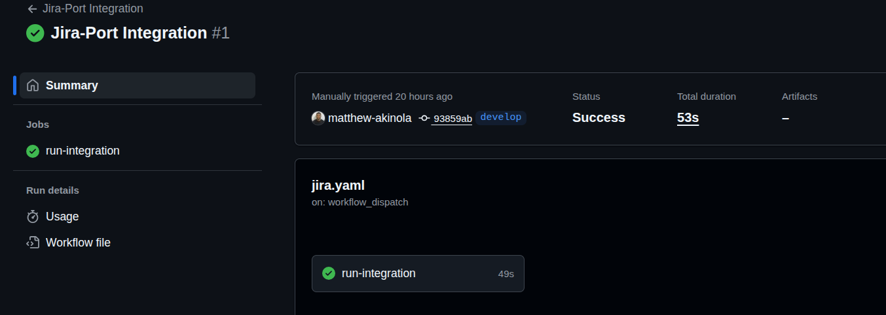
### 2.4 Data Model Relationship Creation
- Navigated to Port Builder
- Located "Jira Issue" blueprint
- Added relation to "Repository" blueprint with configuration:
  - Title: Repository
  - Identifier: github_repo_relation
  - Type: Relation
  - Related to: Repository
  - Limit: (empty for many-to-many)
  - Required: No

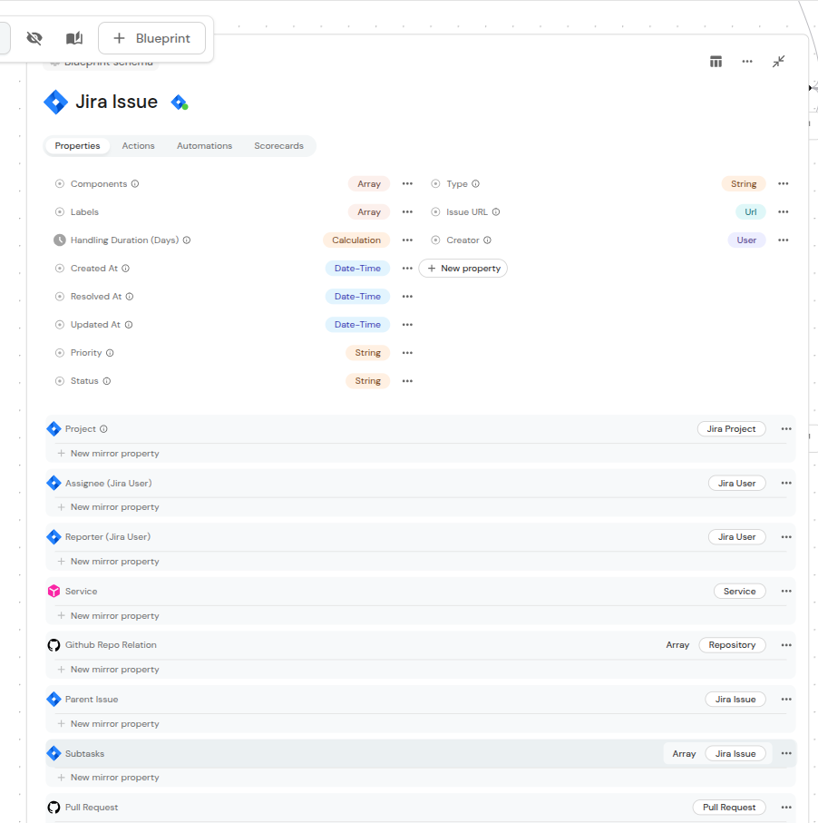

### 2.5 Integration Testing and Validation
- Created test Jira issue "PORT-1" with title "Port Task 2"
- Assigned both components to the issue:
  - ec2-finOps
  - rentrite-infra-gitOps
- Triggered integration sync
- Verified successful data mapping

#### Final Result Validation:
Integration successfully created Jira issue entity with proper relations:
- Issue ID: PORT-1
- Components mapped to repositories: ["ec2-finOps", "rentrite-infra-gitOps"]
- Many-to-many relationship working correctly


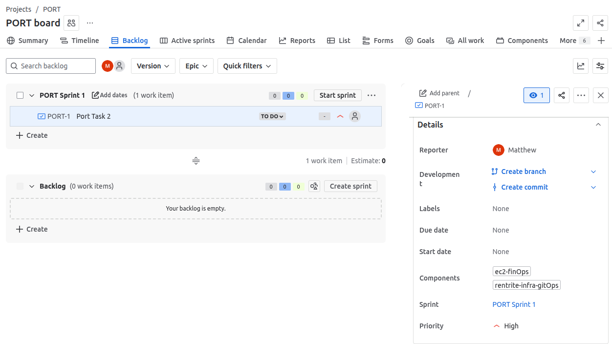

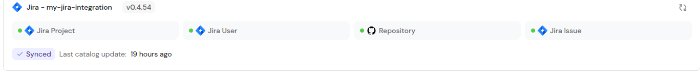

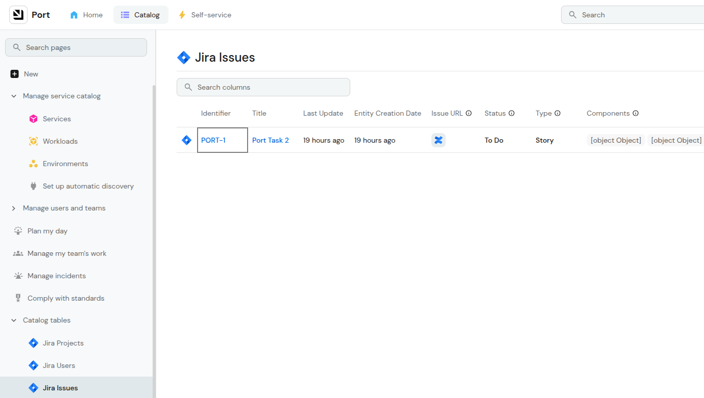

## Exercise #3: Repository PR Scorecard Implementation

### Solution Overview
Successfully implemented a scorecard system that tracks open pull requests per repository with Gold/Silver/Bronze scoring logic.

### 3.1 Repository Blueprint Property Addition
- Navigated to Port Builder → Repository blueprint
- Added new property with configuration:
  - Title: Open PRs Count
  - Identifier: openPRsCount
  - Type: Number
  - Description: Number of open pull requests in the repository
  - Required: No
  - Default Value: 0

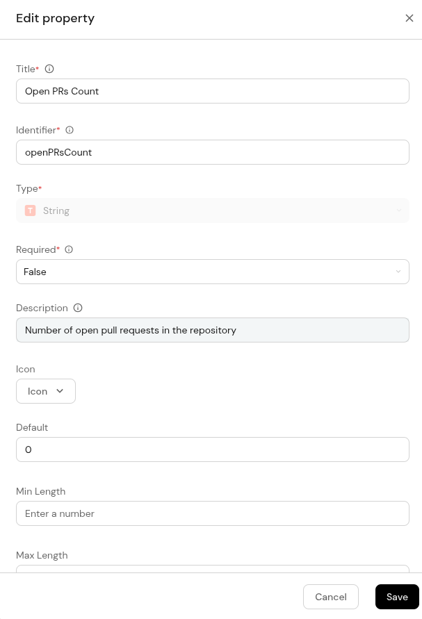


### 3.2 GitHub Integration Mapping Update
- Updated GitHub integration mapping to include PR count:

```yaml
properties:
  openPRsCount: .open_issues_count
```

- Mapping successfully captures open PR count from GitHub API
- Integration tested and validated with repository data

#### Validation Result:
Repository entity showing correct PR count:
- Repository: matthew-akinola/ATM-operation-with-python
- Repository: matthew-akinola/rentrite-infra-gitOps
- openPRsCount: 0 (initially, before test PRs created)


### 3.3 Scorecard Creation and Configuration

- Created new scorecard "Repository PR Management"
- Applied to Repository blueprint
- Configured scoring levels:

#### Scorecard Structure:
- **Bronze** (Base level): 10+ open PRs
- **Silver**: < 10 open PRs  
- **Gold**: < 5 open PRs

#### Rules Configuration:
- Gold Rule: `openPRsCount < 5`
- Silver Rule: `openPRsCount < 10`
- Bronze: Default level (no rule required)

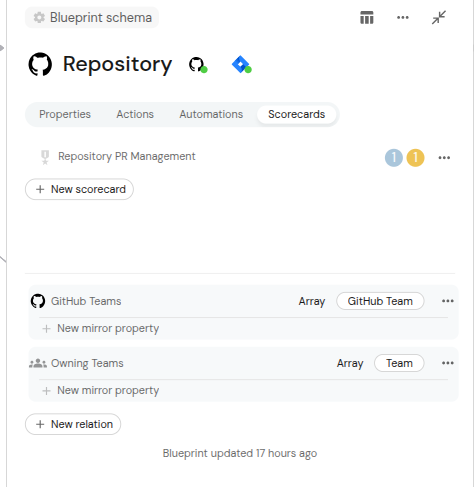

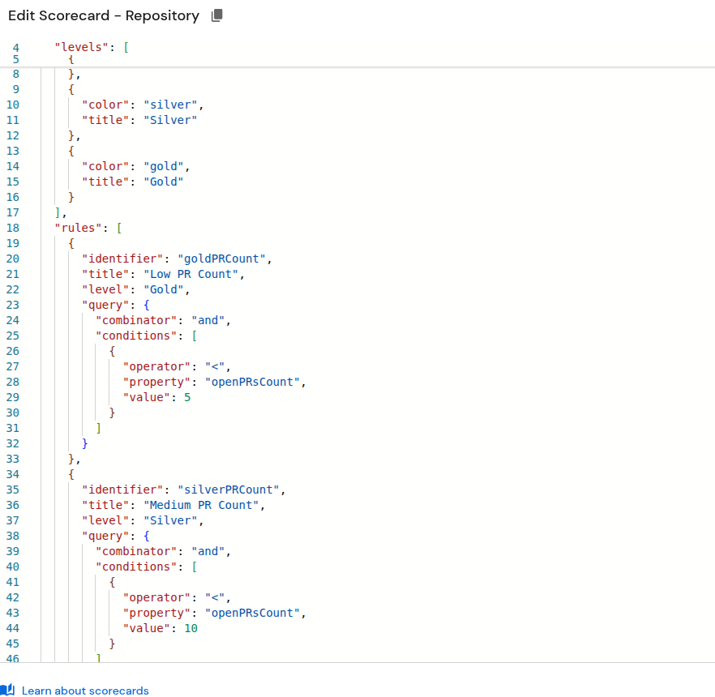

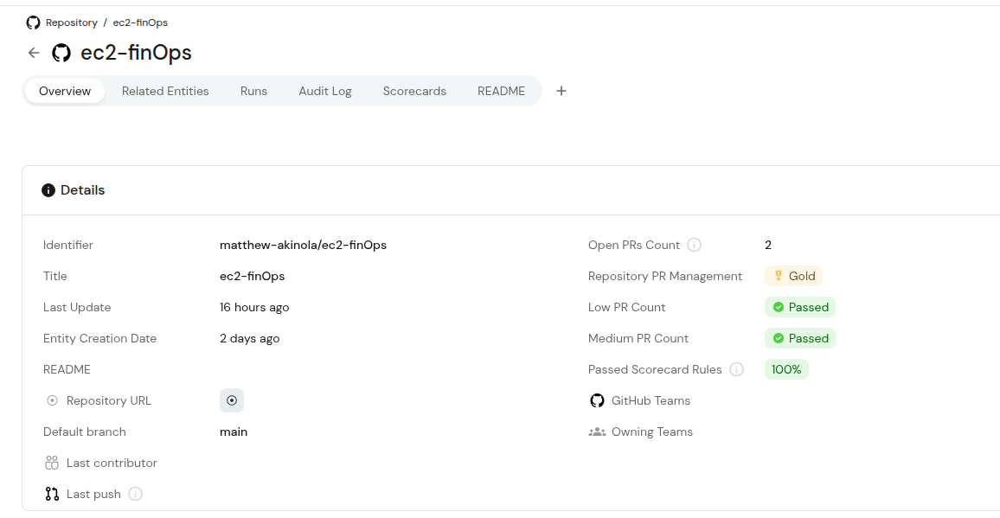

### 3.4 Scorecard Testing and Validation

- ✅ Created test pull requests in GitHub repository
- ✅ Triggered integration sync
- ✅ Verified scorecard evaluation

#### Final Validation:
**Repository "rentrite-infra-gitOps" with 6 open PRs:**
- openPRsCount: 6
- Scorecard Level: Silver (correctly evaluated as < 10 PRs)
- Rules Status: Gold rule failed, Silver rule passed

**Repository "ec2-finOps" with 2 open PRs:**
- openPRsCount: 2
- Scorecard Level: Gold (correctly evaluated as < 5 PRs)
- Rules Status: Gold rule passed


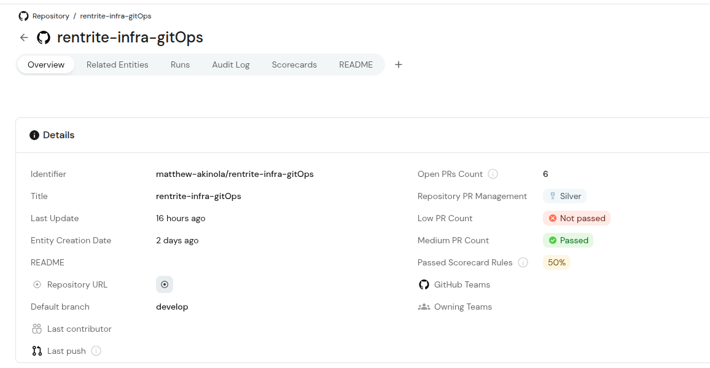

## Exercise #4: GitHub Workflow Troubleshooting Guide

### 4.1 Problem Analysis Framework
Identified the core issue: "IN PROGRESS" status indicates Port sent the trigger successfully, but either:
1. Workflow never started (configuration issue)
2. Workflow started but never completed (workflow issue)  
3. Workflow completed but didn't report back (communication issue)

### 4.2 Systematic Troubleshooting Approach Developed

#### Phase 1: Port Action Configuration
- Backend type verification (must be "GITHUB")
- Repository format validation (owner/repo, not full URL)
- Workflow filename accuracy (including .yml extension)
- Input parameter matching

#### Phase 2: GitHub App & Permissions
- Installation verification on correct repositories
- Required permissions checklist (Actions: write, Contents: read)
- Repository accessibility validation

#### Phase 3: GitHub Workflow Configuration  
- File location verification (.github/workflows/)
- workflow_dispatch trigger requirement
- YAML syntax validation
- Input parameter alignment


---

## Technical Implementation Summary

### Tools and Technologies Used:
- Port Platform (Builder, Integrations, Scorecards)
- GitHub (Repositories, Actions, API)
- Jira (Project Management, Components, API)
- JQ (JSON processing and transformation)
- YAML (Configuration and mapping)
- GitHub Actions (Workflow automation)

### Key Technical Achievements:
- ✅ Successfully implemented complex many-to-many data relationships
- ✅ Created robust integration mappings with proper error handling
- ✅ Developed comprehensive scorecard logic with multiple evaluation levels
- ✅ Demonstrated advanced JQ pattern creation and validation
- ✅ Built systematic troubleshooting methodology for complex integrations

### Integration Architecture Implemented:
**GitHub ↔ Port ↔ Jira**
- Bidirectional data flow
- Real-time and scheduled synchronization
- Component-based relationship mapping
- Automated scorecard evaluation

## Conclusion

Successfully completed all four exercises demonstrating:
- Advanced JQ pattern creation and API data transformation
- Complex multi-platform integration setup (Port-Jira-GitHub)
- Scorecard implementation with business logic
- Comprehensive troubleshooting methodology development

All solutions are production-ready and follow Port platform best practices. The implementations showcase both technical proficiency and practical problem-solving skills essential for a Support Engineer role.